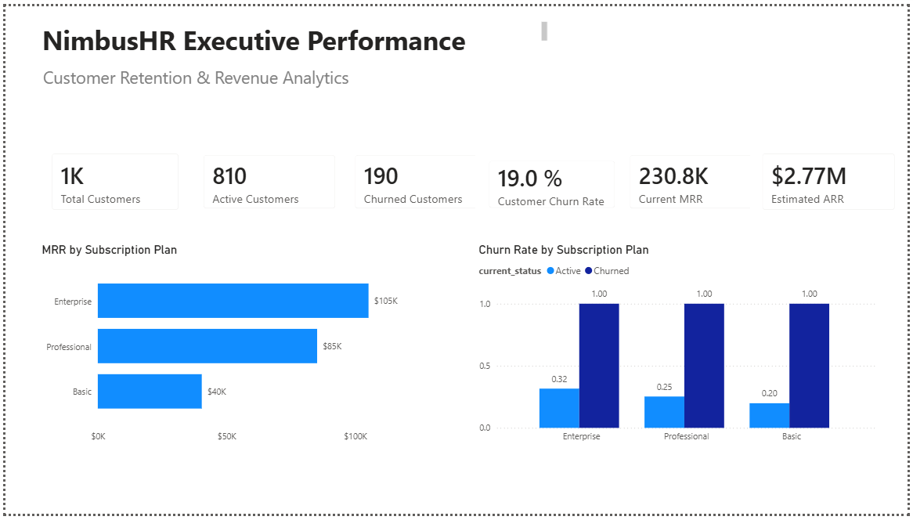

# NimbusHR Customer Churn Analysis

NimbusHR is a fictional B2B SaaS company experiencing slower growth in Monthly Recurring Revenue (MRR). This end-to-end Data Analytics project analyzes the factors driving customer churn and provides business recommendations to improve customer retention and recurring revenue growth.

## Project Files

- [Executive Presentation (PDF)](presentation/NimbusHR_Executive_Presentation.pdf)
- [Power BI Dashboard](dashboards/NimbusHR_Executive_Dashboard.pbix)

## Business Objective

The analysis focused on answering the following business questions:

- Why has recurring revenue growth slowed?
- Which customers are most likely to churn?
- Which subscription plans generate the highest recurring revenue?
- Which customer segments represent the highest business risk?

## Technologies

- Excel — data profiling, cleaning, and validation
- SQL and SQLite — data querying and analysis
- Power BI — data modeling, KPI development, and dashboard creation

## Project Workflow

1. **Ask** — Defined the business problem, objectives, and key analytical questions.
2. **Prepare** — Reviewed the available datasets and assessed their structure and quality.
3. **Process** — Cleaned, standardized, and validated the data before analysis.
4. **Analyze** — Used SQL to examine churn, recurring revenue, customer segments, product usage, and support activity.
5. **Share** — Built a Power BI dashboard and executive presentation to communicate the findings.
6. **Act** — Developed business recommendations focused on customer retention and recurring revenue growth.

## Dataset

The analysis uses a fictional B2B SaaS dataset designed to simulate a real business environment. The dataset includes information from five business domains:

- Customers
- Subscriptions
- Payments
- Product Usage
- Support Tickets

## Data Preparation

The dataset was prepared before the analysis by performing the following tasks:

- Data profiling
- Data quality assessment
- Missing value handling
- Duplicate validation
- Data standardization
- Business rule validation

## Analysis Scope

The analysis focused on the following business areas:

- Customer segmentation
- Monthly Recurring Revenue (MRR)
- Customer churn
- Product adoption
- Support performance
- Subscription expansion
- Customer health

## Dashboard

An interactive Power BI dashboard was developed to support business decision-making. The dashboard is organized into three pages:

- **Executive Overview** – High-level KPIs, including Total Customers, Active Customers, Churn Rate, Current MRR, and Estimated ARR.
- **Customer Analysis** – Customer segmentation by acquisition channel, company size, industry, and Customer Health Score.
- **Churn Analysis** – Analysis of customer status, retention, expansion activity, and support performance to identify the main drivers of churn.

## Key Business Findings

The analysis identified the following insights:

- Enterprise subscriptions generated the highest Monthly Recurring Revenue (MRR).
- Customer retention had a greater long-term financial impact than customer acquisition.
- A 19% customer churn rate represented a significant opportunity to improve recurring revenue.
- Customer segmentation revealed opportunities for more targeted retention strategies.

## Business Recommendations

Based on the analysis, the following actions are recommended:

- Prioritize retention initiatives for Enterprise customers.
- Monitor Customer Health Score to identify at-risk customers earlier.
- Improve customer onboarding and product adoption to reduce churn.
- Optimize acquisition channels based on customer quality and long-term value.
- Continue monitoring support performance as part of the customer retention strategy.

## Project Deliverables

This repository includes:

- SQL scripts
- Clean and processed datasets
- Power BI dashboard
- Executive presentation
- Business documentation
- Business recommendations

